# Entra ID and Intune — Identity, Groups, and Device Enrollment

**Lab:** Kushaltec Simulation Environment
**Tenant:** Microsoft 365 E5 Trial
**Portals:** Microsoft Entra Admin Center · Microsoft 365 Admin Center · Microsoft Intune Admin Center
**Exam objective:** MD-102 — Manage identity and access (Entra ID) · Deploy and manage devices (enrollment)

---

## Prerequisites

- Global Administrator or User Administrator role in Entra ID
- Intune Administrator role for the enrollment sections
- Access to [entra.microsoft.com](https://entra.microsoft.com)
- Access to [admin.microsoft.com](https://admin.microsoft.com)
- Access to the Microsoft Intune Admin Center
- Available M365 E5 licences (Intune + Entra ID P2)
- KT-Grp-Allstaff dynamic group already created in the tenant
- A Windows 11 VM with a local administrator account (KT-LT-0001) for the enrollment sections
- VMware Workstation Pro installed on the host machine for the VM build sections

---

## Part 1 — Create a New User in Microsoft Entra ID

---

### Step 1 — Navigate to Users and open the New User menu

Go to **Entra ID > Users > All users**, then click **New user > Create new user**.

- **Users (1)** selected in the left nav under Entra ID
- **All users (2)** active in the sub-nav
- **Create new user (3)** visible in the dropdown — creates an internal organisational user
- Existing users already in tenant: Kushal KC and Oliver Smith

---

### Step 2 — Fill in the Basics tab

Complete all identity fields on the **Basics** tab.

| Field | Value |
|---|---|
| User principal name | `AlexChen` @ [tenant domain] |
| Mail nickname | `AlexChen` — auto-derived (checkbox ticked) |
| Display name | `Alex Chen` |
| Password | Auto-generated (checkbox ticked) |
| Account enabled | Yes (checkbox ticked) |

> Leave **Derive from user principal name** ticked unless you need a custom mail alias. The mail nickname stays in sync with the UPN prefix automatically.

---

### Step 3 — Fill in the Properties tab

Click **Next: Properties** and enter identity and job information.

| Field | Value |
|---|---|
| First name | `Alex` |
| Last name | `chen` |
| User type | `Member` (default) |
| Job title | *(left blank for this lab)* |
| Department | *(left blank for this lab)* |
| Employee ID | *(left blank for this lab)* |
| Office location | *(left blank for this lab)* |

> User type **Member** = standard internal user. **Guest** is used for external B2B collaborators. In production always populate Department and Job title — these attributes drive dynamic group membership rules.

---

### Step 4 — Review the Assignments tab

Click **Next: Assignments**. No group or role assignments are added at this stage.

The tab shows **No assignments to display**. This is intentional:

- KT-Grp-Allstaff is a **dynamic group** — Entra ID automatically adds Alex Chen once it evaluates the membership rule against his attributes
- KT-Grp-Operations does not exist yet — it will be created in Part 3

> Up to 20 group or role assignments can be made during user creation. For dynamic groups skip this tab — manual membership added here would be overridden by the dynamic rule anyway.

---

### Step 5 — Review + Create

Click **Next: Review + create** and verify all values before submitting.

| Field | Value |
|---|---|
| User principal name | `AlexChen` @ [tenant domain] |
| Display name | `Alex Chen` |
| Mail nickname | `AlexChen` |
| Account enabled | Yes |
| First name | Alex |
| Last name | chen |
| User type | Member |
| Groups assigned | None |
| Roles assigned | None |

Click **Create**. The user account is provisioned immediately in the tenant.

---

### Step 6 — Verify the user appears in All users

Navigate back to **Users > All users** to confirm Alex Chen is listed.

The tenant now shows **3 users found**:

| Display name | User type |
|---|---|
| Alex Chen | Member — newly created |
| Kushal KC | Member — tenant admin |
| Oliver Smith | Member — existing user |

---

## Part 2 — Assign a Microsoft 365 Licence

---

### Step 7 — Assign a licence via Microsoft 365 Admin Center

Switch to **admin.microsoft.com** and assign the licence to Alex Chen.

- Open **Microsoft 365 Admin Center (1)** at admin.microsoft.com
- Click **Users > Active users (2)** in the left nav
- Check the checkbox next to **Alex Chen (3)** — right-hand panel opens
- Click the **Licenses and apps (4)** tab in the panel

| Field | Value |
|---|---|
| Select location | `Australia` — set this FIRST, required before licence assignment |
| Intune | 23 of 25 licences available — tick to assign |
| Microsoft Entra ID P2 | 23 of 25 licences available — tick to assign |

Tick the required licences and click **Save changes**.

> A usage location is mandatory before any M365 licence can be assigned. Without it the assignment will fail. For Australian tenants always set **Australia** for data residency compliance.

---

## Part 3 — Create a New Security Group in Microsoft Entra ID

---

### Step 8 — Navigate to Groups and click New group

Go to **Entra ID > Groups**, then click **New group** in the toolbar.

Groups Overview stats visible in this screenshot:

| Metric | Count |
|---|---|
| Total groups | 2 |
| Dynamic groups | 1 (KT-Grp-Allstaff) |
| M365 groups | 0 |
| Security groups | 2 |
| Cloud groups | 2 |
| On-premises groups | 0 |

---

### Step 9 — Configure the new group

Fill in all fields on the **New Group** form.

| Field | Value |
|---|---|
| Group type | `Security` |
| Group name | `KT-Grp-Operations` |
| Group description | `KT-Grp-Operations` |
| Entra roles assignable | `No` |
| Membership type | `Assigned` |
| Owners | 1 owner selected — Kushal KC |
| Members | 1 member selected |

- **Membership type: Assigned** — members are added and removed manually by an admin. Different from KT-Grp-Allstaff which uses **Dynamic** membership driven by attribute rules.
- **Entra roles assignable: No** — correct for a standard departmental group. Set Yes only for privileged access groups that need to hold Entra directory roles. Requires Entra ID P2.
- **This setting cannot be changed after the group is created** — double-check before clicking Create.

Click **Create**.

---

### Step 10 — Verify both groups in All groups

Navigate to **Groups > All groups** to confirm both groups exist.

| Name | Group type | Membership type |
|---|---|---|
| KT-Grp-Allstaff | Security | Dynamic |
| KT-Grp-Operations | Security | Assigned |

The tenant now has 2 security groups — dynamic for all-staff policy targeting and assigned for operations team management.

---

## Part 4 — Build a New Lab VM (KT-LT-0002) and Install Windows 11

---

### Step 11 — Start the New Virtual Machine Wizard

In VMware Workstation Pro, open **File > New Virtual Machine** and select the configuration type.

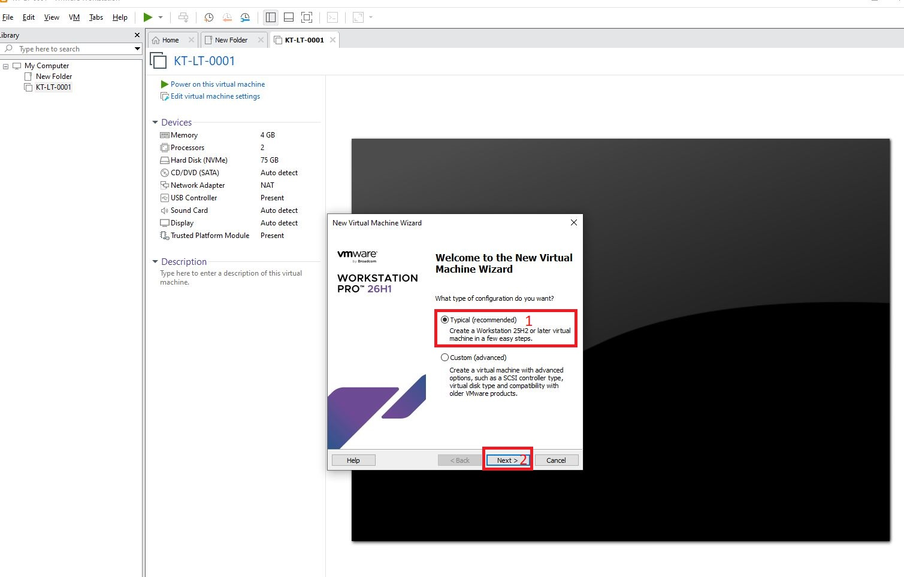

- **Typical (recommended) (1)** selected — creates a Workstation 25H2 or later virtual machine in a few easy steps
- **Next (2)** clicked to continue

> **Custom (advanced)** is only needed for non-default options like a specific SCSI controller type, a different virtual disk type, or compatibility with older VMware product versions. Typical is sufficient for a standard MD-102 lab VM.

---

### Step 12 — Point the wizard at the Windows 11 ISO

Select **Installer disc image file (iso)** and browse to the Windows 11 ISO on the host machine.

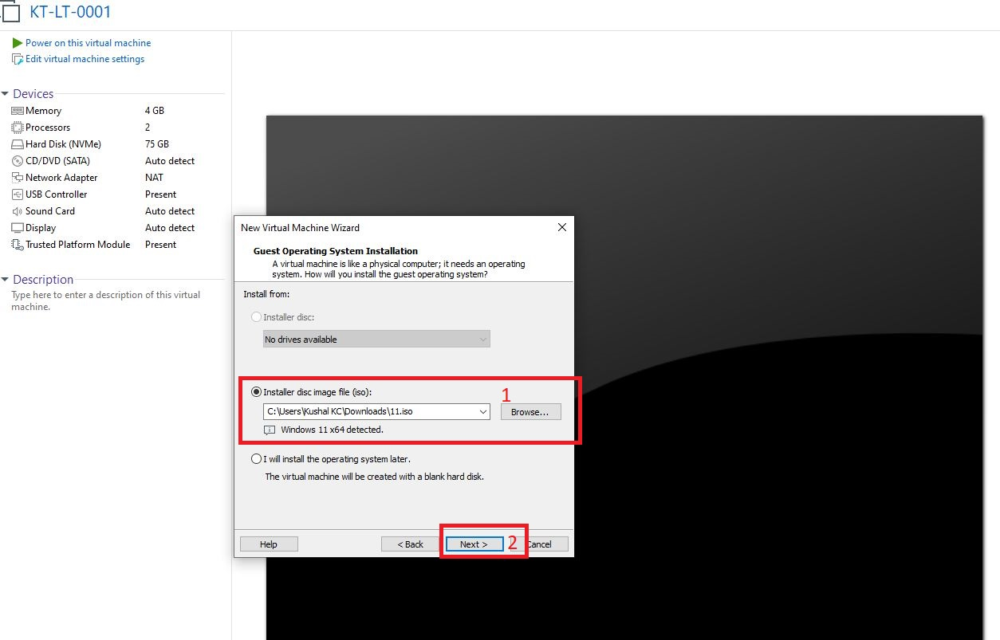

- **Installer disc image file (iso) (1)** selected, pointing to `C:\Users\Kushal KC\Downloads\11.iso`
- VMware automatically detects **Windows 11 x64 detected** from the ISO
- **Next (2)** clicked to continue

> Choosing **I will install the operating system later** instead would create the VM with a blank hard disk and skip OS detection — not used here since the ISO is already available.

---

### Step 13 — Name the virtual machine

Give the VM a name and confirm the storage location on the host.

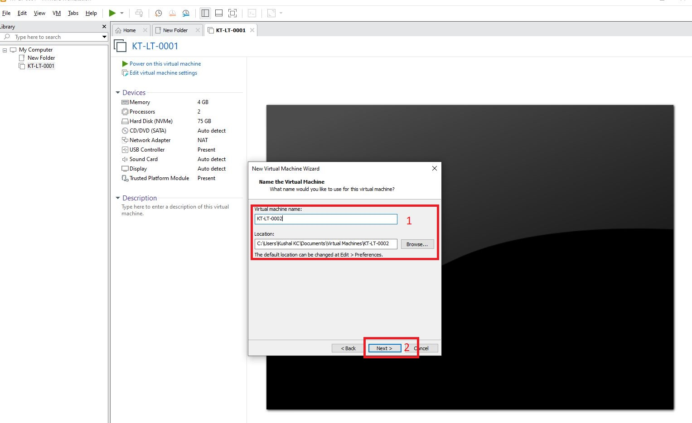

| Field | Value |
|---|---|
| Virtual machine name | `KT-LT-0002` |
| Location | `C:\Users\Kushal KC\Documents\Virtual Machines\KT-LT-0002` |

**Next (2)** clicked to continue.

> Following a consistent naming convention (KT-LT-0001, KT-LT-0002, …) keeps the lab inventory readable as more VMs are added across phases.

---

### Step 14 — Configure TPM encryption for the VM

Because Windows 11 requires a virtual TPM, VMware prompts to encrypt the files that support it.

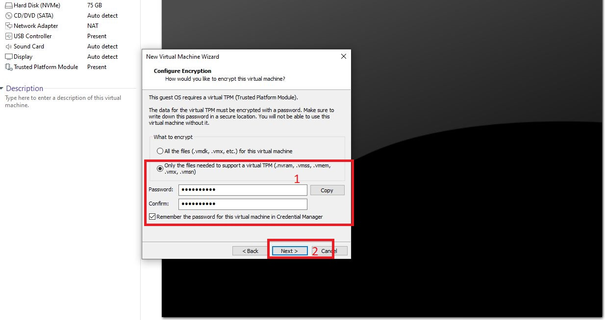

- **Only the files needed to support a virtual TPM (.nvram, .vmss, .vmem, .vmx, .vmsn) (1)** selected, with password and confirm password set
- **Remember the password for this virtual machine in Credential Manager** ticked
- **Next (2)** clicked to continue

> The alternative option, **All the files (.vmdk, etc.) for this virtual machine**, encrypts the entire VM including the virtual disk. Encrypting only the TPM-support files is sufficient to satisfy the Windows 11 TPM requirement without adding overhead to every disk read/write.

---

### Step 15 — Specify disk capacity

Set the maximum disk size for the VM's virtual hard disk.

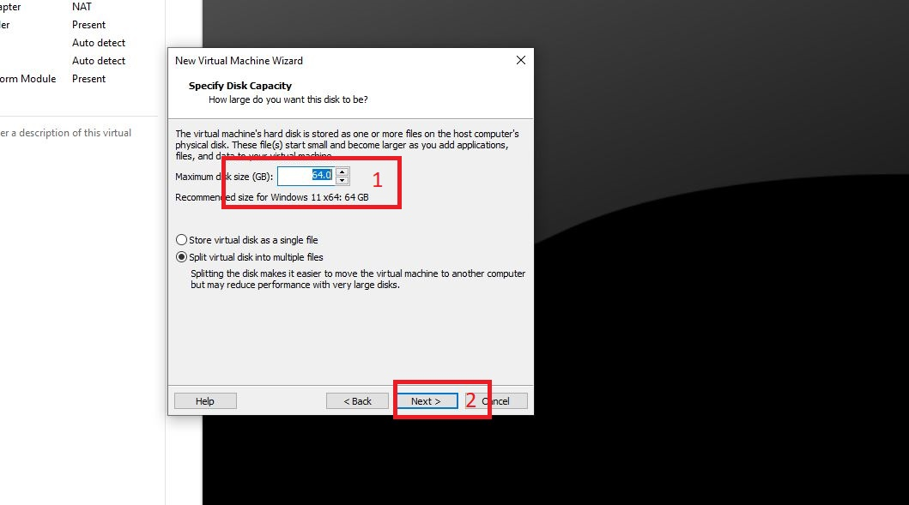

| Field | Value |
|---|---|
| Maximum disk size (GB) | `64.0` (VMware's recommended size for Windows 11 x64) |
| Disk storage type | Split virtual disk into multiple files |

**Next (2)** clicked to continue.

> **Split virtual disk into multiple files** makes the VM easier to move to another computer later, at a small performance cost on very large disks — an acceptable trade-off for a lab VM that may need to be copied or backed up.

---

### Step 16 — Finish the wizard and begin disk creation

Review the summary and click Finish to create the VM and start Windows installation.

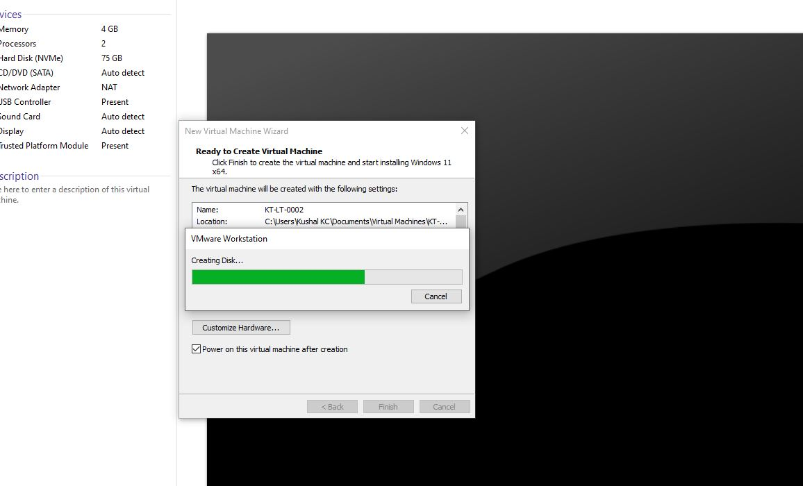

- Summary confirms **Name: KT-LT-0002** and the location set in Step 13
- **Power on this virtual machine after creation** ticked — the VM will boot straight into Windows Setup
- VMware shows **Creating Disk…** progress while the virtual disk is provisioned

---

### Step 17 — Select language settings in Windows Setup

On first boot from the ISO, Windows Setup asks for language and currency format.

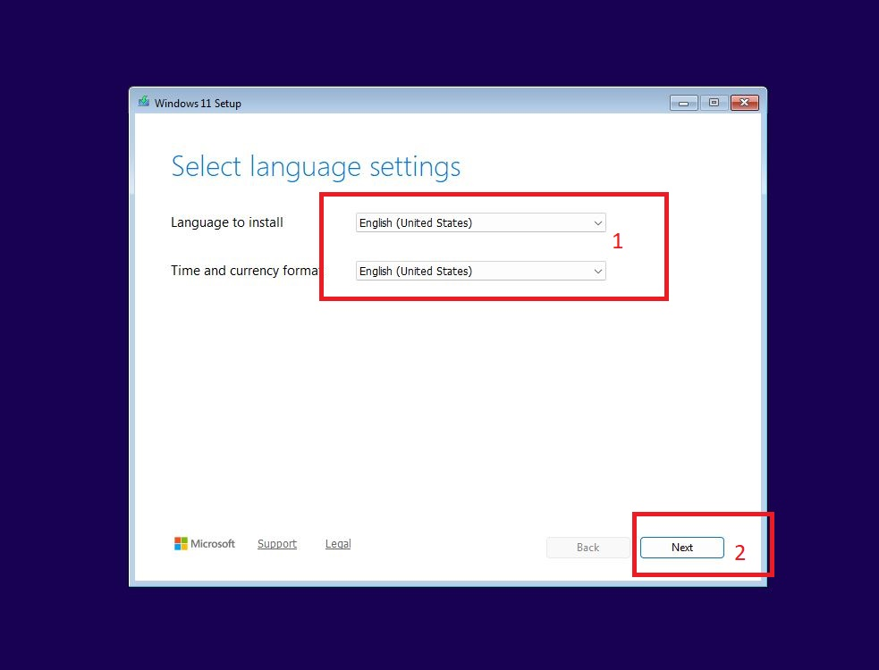

| Field | Value |
|---|---|
| Language to install | `English (United States)` |
| Time and currency format | `English (United States)` |

**Next (2)** clicked to continue.

---

### Step 18 — Select the setup option

Choose to install Windows 11 fresh rather than repair an existing installation.

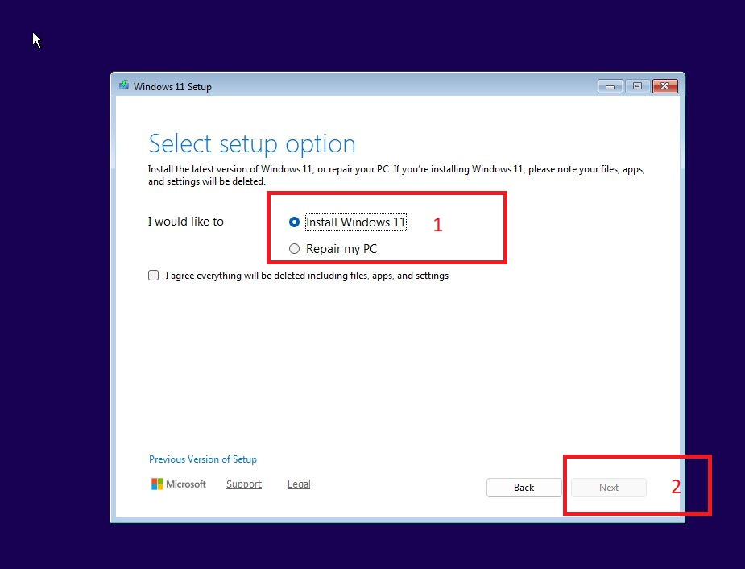

- **Install Windows 11 (1)** selected — the alternative, **Repair my PC**, is only relevant when recovering an existing damaged installation
- **Next (2)** — greyed out at this point until edition/licence terms are accepted on the following screens (not pictured)

---

### Step 19 — Select the install location

With the 64 GB virtual disk created in Step 15 fully unallocated, select it as the install target.

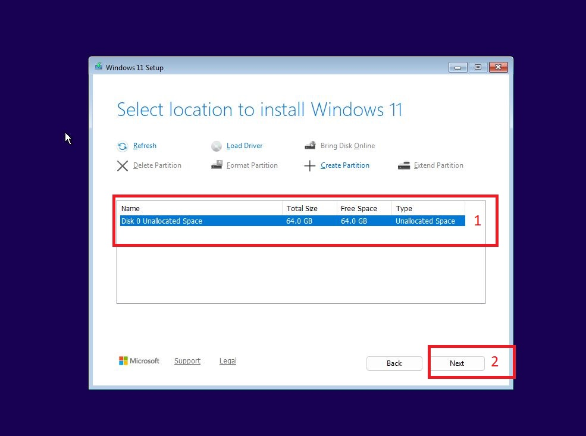

- **Disk 0 Unallocated Space (1)** — Total Size 64.0 GB, Free Space 64.0 GB, Type Unallocated Space — selected
- **Next (2)** clicked to continue

> Because this is a brand new virtual disk, no partitioning is required first — Windows Setup will automatically create the necessary system, MSR, and primary partitions on this unallocated space.

---

### Step 20 — Confirm and start the install

Review the recap and begin the installation.

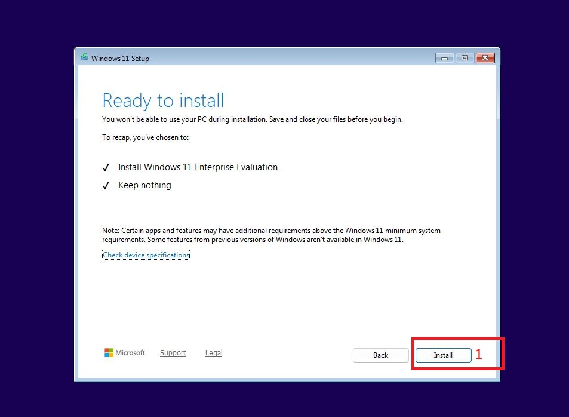

Recap confirms:

- ✓ Install Windows 11 Enterprise Evaluation
- ✓ Keep nothing

**Install (1)** clicked to begin.

> **Windows 11 Enterprise Evaluation** is the correct edition choice for an MD-102 lab — it unlocks the full Enterprise feature set (including advanced Intune and Conditional Access capabilities) for evaluation without needing a retail licence key.

---

### Step 21 — Installation progress

Windows 11 installs and the VM restarts several times automatically.

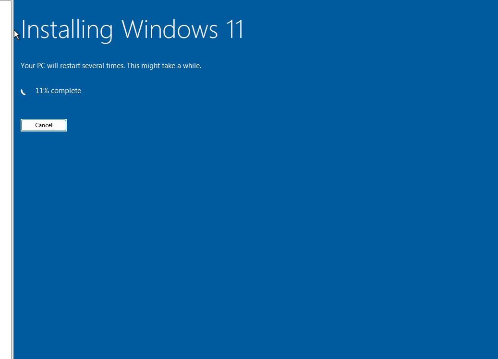

The progress screen shows **11% complete** at this point in the install. No interaction is required — the VM will continue through file copy, feature installation, and update phases before reaching the out-of-box experience (OOBE).

---

### Step 22 — Open the Run dialog to check TPM status

After OOBE setup completes and the desktop loads, open **Run** and launch the TPM management console.

- **tpm.msc (1)** typed into the Run dialog
- **OK (2)** clicked to launch TPM Management on Local Computer

---

### Step 23 — Verify the virtual TPM is ready

Confirm the TPM configured back in Step 14 is recognised and functioning inside the guest OS.

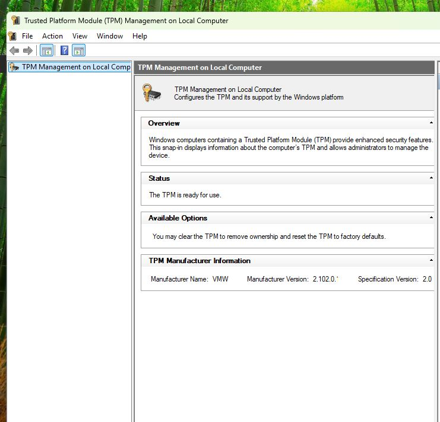

| Field | Value |
|---|---|
| Status | The TPM is ready for use |
| Manufacturer Name | VMW |
| Manufacturer Version | 2.102.0.x |
| Specification Version | 2.0 |

> **Manufacturer Name: VMW** confirms this is VMware's virtualised TPM rather than a physical hardware TPM — expected and fully supported behaviour for a Workstation Pro VM, and sufficient to satisfy Windows 11's TPM 2.0 requirement for the rest of the MD-102 lab.

---

### Step 24 — Confirm the repository documentation structure

With KT-LT-0002 built and TPM verified, the lab documentation folder structure tracks each phase as a separate markdown file with its supporting screenshots.

- **Screenshots (1)** — folder holding all numbered screenshot evidence referenced throughout these docs
- **phase1-setup.md (2)** — this file
- **Readme.md (3)** — repository overview

KT-LT-0002 is now available as a second lab machine alongside KT-LT-0001, giving a clean environment for testing scenarios (such as Autopilot or compliance policy changes) without disturbing the already-enrolled KT-LT-0001 documented in Part 5 below.

---

## Part 5 — Configure MDM Automatic Enrollment Scope

---

### Step 25 — Open Devices and select the Windows platform

Go to **Devices > Overview**, then click the **Windows** platform tile.

- **Devices (1)** selected in the left nav
- **Windows (2)** platform tile clicked to manage Windows-specific enrollment settings

The "Something went wrong" tiles on this overview are expected in a fresh trial tenant with no devices or policies enrolled yet — they will populate once devices and configuration profiles exist.

---

### Step 26 — Open Device onboarding and Enrollment

From the Windows devices view, expand **Device onboarding** and click **Enrollment**.

- **Device onboarding (1)** expanded in the left nav
- **Enrollment (2)** selected — this is where MDM scope and enrollment restrictions are configured

At this point **0 devices** are shown — nothing has enrolled into this tenant yet.

---

### Step 27 — Open Automatic Enrollment

On the Windows | Enrollment page, click **Automatic Enrollment**.

- **Automatic Enrollment (1)** — configures Windows devices to enroll automatically when they join or register with Microsoft Entra ID

This is the setting that controls whether a device gets MDM-managed the moment a work account signs in, versus requiring a separate manual enrollment step.

---

### Step 28 — Set MDM user scope to Some and select the group

Set **MDM user scope** to **Some**, then choose the group that should be in scope for automatic enrollment.

- **Some (1)** selected for MDM user scope — only members of a chosen group will be enrolled, rather than every user in the tenant
- **KT-Grp-All IT staff (2)** ticked in the Select groups panel — 1 result found, 1 selected
- **Select (3)** clicked to confirm the group choice

**Key point:** Scoping to **Some** with a specific group is the safer rollout pattern for production. Setting this to **All** would enroll every licensed user's device automatically — fine for a small pilot, but risky to apply tenant-wide without testing first.

---

### Step 29 — Confirm the group assignment

Back on the main enrollment configuration page, confirm the group count shown.

- **1 group selected (1)** confirms KT-Grp-All IT staff is now scoped for MDM automatic enrollment

Click **Save** to commit this configuration (not shown — Save/Discard/Delete buttons sit at the bottom of this page).

---

## Part 6 — Enroll the Windows Device

---

### Step 30 — Open Access work or school on the device

On the test VM (KT-LT-0001), open **Settings > Accounts**, then click **Access work or school**.

- **Access work or school (1)** — this is the entry point for joining a device to Entra ID or enrolling it in MDM

The device is currently signed in locally as **KKC (Local Account, Administrator)** — this is the lab admin account used to build the VM, separate from the end-user account being enrolled.

---

### Step 31 — Connect a work or school account

Click **Connect**, then enter the test user's email address.

- **Connect (1)** clicked to open the Microsoft account dialog
- **Email address (2)** field — entered as the test user's UPN (osmith@kushalkctec.onmicrosoft.com)

Note the **Alternate actions** at the bottom of the dialog: **Join this device to Microsoft Entra ID** and **Join this device to a local Active Directory domain**. Using the email field directly (rather than these alternate links) adds a work account to the existing local profile rather than fully Entra-joining the device — the distinction matters for how the device shows up in Intune afterward.

---

### Step 32 — Enter password and sign in

Enter the password for the work account and click **Sign in**.

- **Sign in (1)** clicked after entering the password for osmith@kushalkctec.onmicrosoft.com

---

### Step 33 — Confirm the device is connected

The "You're all set!" screen confirms the device is now connected to the tenant.

- **Done (1)** clicked to finish

The message confirms: **This device is connected to Kushal kc tec**, and explains that switching to this account requires using the Start button and Switch account, signing in with the OSmith@Kushalkctec.onmicrosoft.com email and password.

---

### Step 34 — Updates apply during enrollment

After confirming, the device applies policy and may show an update screen.

This full-screen message — **Updates are underway, please keep your computer on** — appears as Intune pushes initial policy and compliance settings to the newly enrolled device. No interaction is needed here, just patience.

---

### Step 35 — Windows Hello requirement enforced

On first sign-in with the new account, the device may prompt to set up Windows Hello.

- **OK (1)** clicked to proceed

This prompt — **Your organization requires you to set up your work or school account with Windows Hello Face, Fingerprint, or PIN** — is strong evidence that a Conditional Access or Identity Protection policy is being enforced against this account, requiring stronger authentication before access is granted.

---

### Step 36 — Sign in as the enrolled user

After setup, switching accounts and signing in shows the new user on the Start menu.

- **Oliver Smith (1)** shown at the bottom of the Start menu — confirms the device is now signed in as the enrolled work account rather than the local KKC admin account

---

### Step 37 — Verify the account in Manage Accounts

Open **Control Panel > User Accounts > Manage Accounts** to confirm the account type.

- **Oliver Smith — AzureAD\OliverSmith — Password protected (1)** confirms the account is registered on the device as an Entra ID (AzureAD) identity, not a local Windows account

This is the clearest proof point that the device-to-tenant connection succeeded: the account prefix **AzureAD\\** rather than a local machine name confirms cloud identity is now controlling sign-in on this device.

---

### Step 38 — Confirm the device appears in Intune as a managed device

Open the **Intune Admin Center > Devices > All devices** and confirm the enrolled device is now listed.

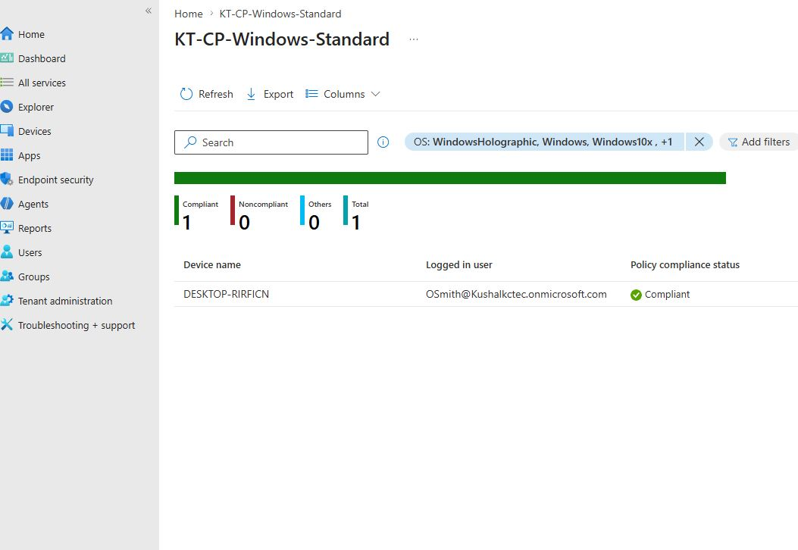

- **KT-LT-0001 (1)** appears in the All devices list — confirms Intune itself, not just the device's local enrollment wizard, recognises this device as managed
- Compliance status, OS version, and last check-in time confirm the device successfully completed MDM enrollment from the admin's point of view

This is the closing proof point for Phase 1: the device-side "You're all set" message (Step 33) only confirms the device attempted the join — this screenshot confirms Intune actually received and is tracking that enrollment.

## Key Concepts

### Dynamic vs Assigned Membership

| | Assigned | Dynamic |
|---|---|---|
| Membership | Admin manages manually | Entra ID manages via attribute rules |
| Licence required | Entra ID Free | Entra ID P1 or P2 |
| Use case | Small teams, project groups | All-staff, department-based targeting |

### UPN vs Mail Nickname

- **UPN** is the sign-in identity (`AlexChen@domain.com`) used for Entra ID authentication
- **Mail nickname** is the local part of the email address
- Mail nickname auto-derives from UPN prefix by default — only uncheck for a custom alias
- UPN must be unique across the entire tenant

### Usage Location

- Required before any M365 licence can be assigned
- Determines data residency and service availability by country
- For Australian tenants always set **Australia**

### Entra Roles Assignable to Group

- When Yes, the group can hold Entra ID directory roles (e.g. Global Admin, User Admin)
-Requires Entra ID P2 — only enable for privileged access groups
- **Cannot be changed after group creation**

### Virtual TPM for Windows 11 VMs

- Windows 11 requires TPM 2.0 — VMware Workstation Pro satisfies this with a virtual TPM device rather than relying on the host's physical TPM
- The virtual TPM's supporting files (.nvram, .vmss, .vmem, .vmx, .vmsn) must be encrypted with a password set at VM creation time — losing this password makes the VM unusable
- `tpm.msc` inside the guest OS is the quickest way to confirm the virtual TPM is present and **ready for use** before proceeding with any Intune compliance policy that enforces TPM-based attestation

### Windows 11 Enterprise Evaluation

- Provides the full Enterprise feature set without a retail product key, ideal for lab and training environments
- Functionally equivalent to a licensed Enterprise installation for the purposes of testing Intune, Conditional Access, and compliance policies in this lab

### MDM User Scope: None vs Some vs All

| | None | Some | All |
|---|---|---|---|
| Behaviour | No automatic enrollment | Only selected groups auto-enroll | Every licensed user auto-enrolls |
| Use case | Manual enrollment only, or testing | Pilot groups, phased rollout | Mature tenant, organization-wide MDM |
| Risk | Lowest — nothing enrolls unexpectedly | Controlled — limited blast radius | Highest — any licensed user's device enrolls |

Scoping to **Some** with a defined group (as done here with KT-Grp-All IT staff) is the standard approach for testing and staged rollouts before expanding to **All**.

### Access Work or School vs Entra Join

Typing an email address directly into the **Add a work or school account** field adds a secondary work identity to the device alongside the existing local account. This is different from selecting **Join this device to Microsoft Entra ID**, which fully joins the device itself to the tenant and replaces the local sign-in model. Both paths can trigger MDM enrollment, but they register differently in Entra ID (Registered vs Entra joined) and affect what device-level policies can apply.

### Why Windows Hello Appeared

The Windows Hello prompt on first sign-in is a strong signal that a Conditional Access policy or Authentication Methods policy in the tenant requires phishing-resistant or multi-factor authentication for this account. This is expected behaviour once Conditional Access is layered on top of basic enrollment — it will be covered in more depth in a future phase.

### Confirming Enrollment Success

The most reliable on-device check that an Entra identity is active is the **AzureAD\\username** prefix shown in Control Panel's Manage Accounts. A local account would show the device's hostname instead (e.g. **KT-LT-0001\\KKC**). This distinction is a fast way to confirm whether a device-side issue is an enrollment problem or a sign-in problem.

---

## Common Issues and Troubleshooting

| Issue | Likely Cause | Resolution |
|---|---|---|
| Device does not appear in Intune after sign-in | Enrollment delay (sync can take several minutes) or MDM scope not saved | Wait for the next Intune sync cycle; confirm Automatic Enrollment was saved with the correct group |
| User not enrolling automatically despite Some scope | User's account is not actually a member of the scoped group | Verify group membership in Entra ID — direct or dynamic membership must be confirmed, not just intended |
| Windows Hello setup loops or fails | PIN complexity policy conflict, or TPM unavailable on the VM | Check Authentication Methods policy complexity requirements; confirm the VM has a virtual TPM enabled |
| Account shows as local instead of AzureAD in Manage Accounts | Email was added via "Add a work or school account" without completing full Entra join | Use Join this device to Microsoft Entra ID instead if a full device join is required |
| VM fails to boot after creation | ISO path incorrect or VM created without TPM when Windows 11 requires one | Re-check the Installer disc image file path; confirm the virtual TPM device was added during the New Virtual Machine Wizard |
| tpm.msc shows TPM not ready or not present | VM was created without selecting TPM encryption, or the VM was migrated from an older VMware product without the feature | Recreate the VM with TPM encryption enabled in the New Virtual Machine Wizard, or check the VM's hardware settings for a Trusted Platform Module device |

---

## Lab Completion Summary

| Task | Status |
|---|---|
| Created user Alex Chen in Microsoft Entra ID | ✅ |
| Set UPN, display name, and auto-generated password | ✅ |
| Reviewed all wizard tabs before submission | ✅ |
| Verified Alex Chen in All users (3 users total) | ✅ |
| Set usage location to Australia | ✅ |
| Assigned M365 licences to Alex Chen | ✅ |
| Created KT-Grp-Operations — Assigned Security group | ✅ |
| Verified both groups in All groups list | ✅ |
| Built KT-LT-0002 in VMware Workstation Pro with virtual TPM encryption | ✅ |
| Installed Windows 11 Enterprise Evaluation on KT-LT-0002 | ✅ |
| Verified virtual TPM ready for use via tpm.msc | ✅ |
| Set MDM user scope to Some, scoped to KT-Grp-All IT staff | ✅ |
| Confirmed 1 group selected on Automatic Enrollment | ✅ |
| Connected work account via Access work or school on KT-LT-0001 | ✅ |
| Signed in as osmith@kushalkctec.onmicrosoft.com | ✅ |
| Confirmed device connected — "You're all set" | ✅ |
| Windows Hello requirement enforced on first sign-in | ✅ |
| Verified AzureAD\\OliverSmith registered as the active account | ✅ |

---

*Kushaltec Lab · MD-102 Endpoint Administrator · Phase 1 Setup*
*Tenant domain, UPNs, Object IDs, and passwords redacted or obscured where applicable.*
