# Entra ID and Intune — Identity, Groups, and Device Enrollment

**Lab:** Kushaltec Simulation Environment  
**Tenant:** Microsoft 365 E5 Trial  
**Portals:** Microsoft Entra Admin Center · Microsoft 365 Admin Center · Microsoft Intune Admin Center  
**Exam objective:** MD-102 — Manage identity and access (Entra ID) · Deploy and manage devices (enrollment)

---

## Prerequisites

- Global Administrator or User Administrator role in Entra ID
- Intune Administrator role for the enrollment sections
- Access to [entra.microsoft.com](https://entra.microsoft.com)
- Access to [admin.microsoft.com](https://admin.microsoft.com)
- Access to the Microsoft Intune Admin Center
- Available M365 E5 licences (Intune + Entra ID P2)
- KT-Grp-Allstaff dynamic group already created in the tenant
- A Windows 11 VM with a local administrator account (KT-LT-0001) for the enrollment sections

---

## Part 1 — Create a New User in Microsoft Entra ID

---

### Step 1 — Navigate to Users and open the New User menu

Go to **Entra ID > Users > All users**, then click **New user > Create new user**.

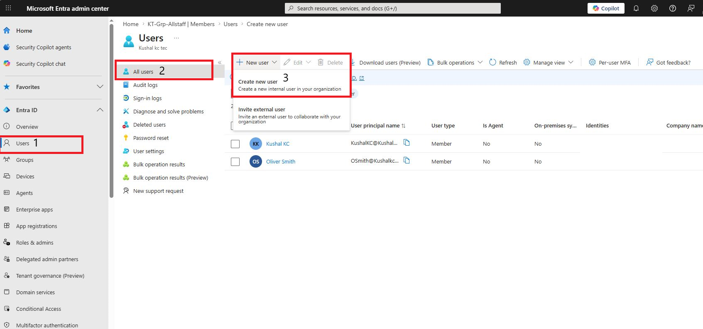

- **Users (1)** selected in the left nav under Entra ID
- **All users (2)** active in the sub-nav
- **Create new user (3)** visible in the dropdown — creates an internal organisational user
- Existing users already in tenant: Kushal KC and Oliver Smith
- Breadcrumb shows path came from **KT-Grp-Allstaff | Members** — navigated here from within the dynamic group context

---

### Step 2 — Fill in the Basics tab

Complete all identity fields on the **Basics** tab.

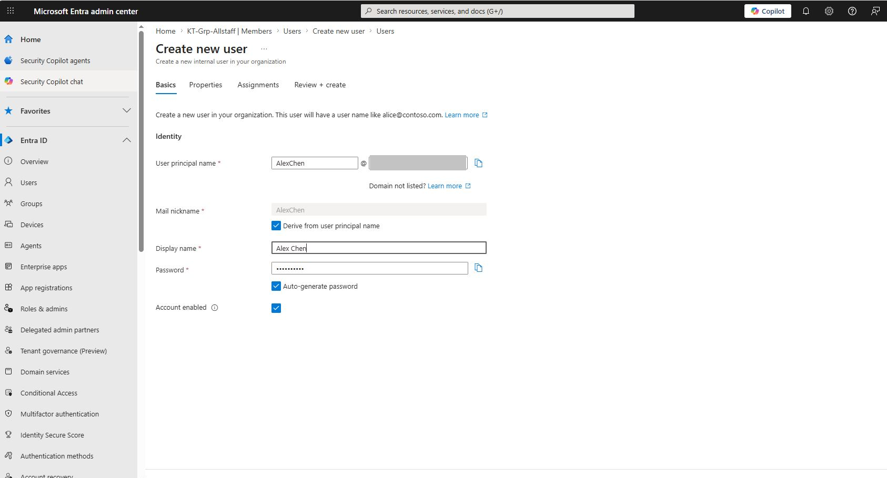

| Field | Value |
|---|---|
| User principal name | `AlexChen` @ [tenant domain] |
| Mail nickname | `AlexChen` — auto-derived (checkbox ticked) |
| Display name | `Alex Chen` |
| Password | Auto-generated (checkbox ticked) |
| Account enabled | Yes (checkbox ticked) |

> Leave **Derive from user principal name** ticked unless you need a custom mail alias. The mail nickname stays in sync with the UPN prefix automatically.

---

### Step 3 — Fill in the Properties tab

Click **Next: Properties** and enter identity and job information.

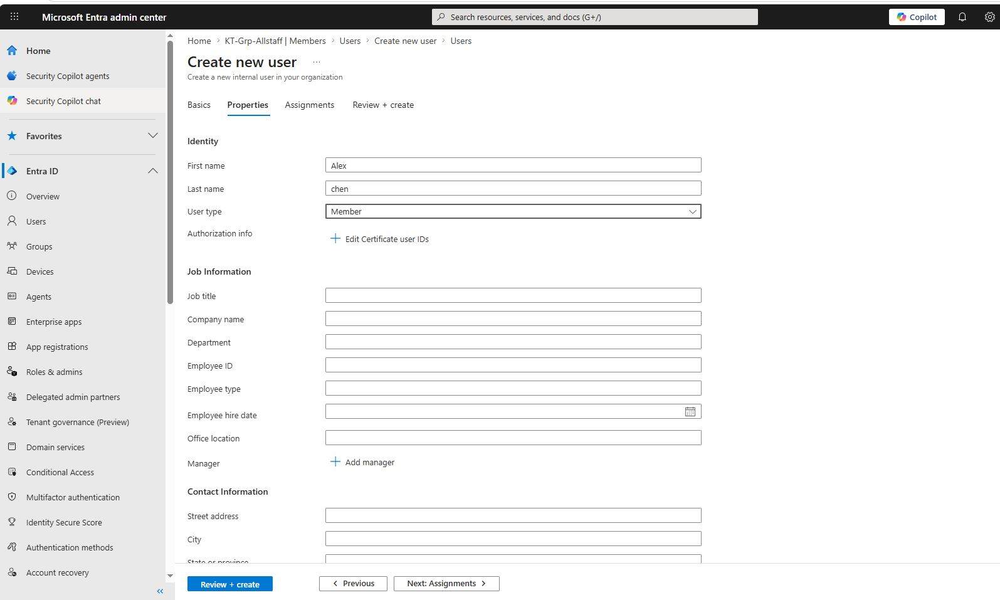

| Field | Value |
|---|---|
| First name | `Alex` |
| Last name | `chen` |
| User type | `Member` (default) |
| Job title | *(left blank for this lab)* |
| Department | *(left blank for this lab)* |
| Employee ID | *(left blank for this lab)* |
| Office location | *(left blank for this lab)* |

> User type **Member** = standard internal user. **Guest** is used for external B2B collaborators. In production always populate Department and Job title — these attributes drive dynamic group membership rules.

---

### Step 4 — Review the Assignments tab

Click **Next: Assignments**. No group or role assignments are added at this stage.

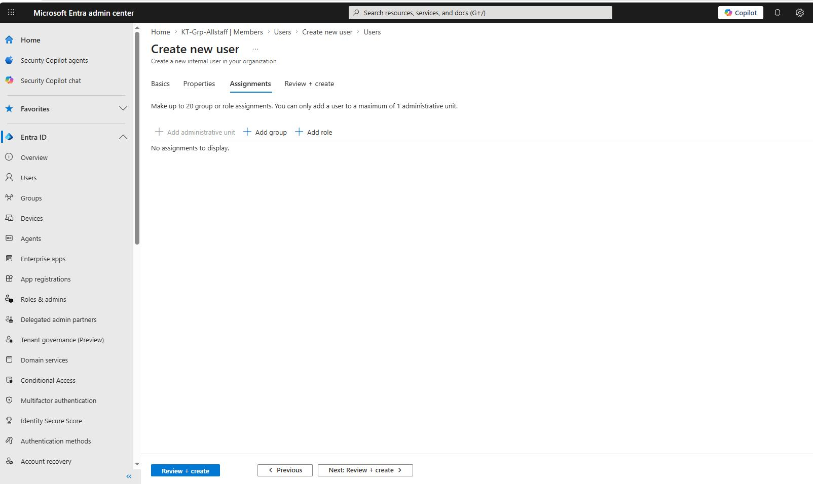

The tab shows **No assignments to display**. This is intentional:

- KT-Grp-Allstaff is a **dynamic group** — Entra ID automatically adds Alex Chen once it evaluates the membership rule against his attributes
- KT-Grp-Operations does not exist yet — it will be created in Part 3

> Up to 20 group or role assignments can be made during user creation. For dynamic groups skip this tab — manual membership added here would be overridden by the dynamic rule anyway.

---

### Step 5 — Review + Create

Click **Next: Review + create** and verify all values before submitting.

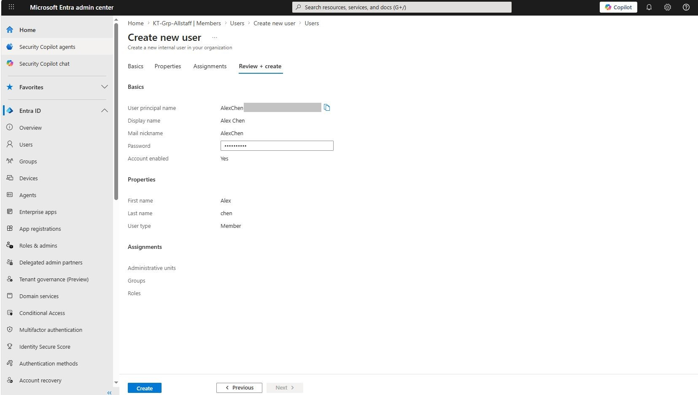

| Field | Value |
|---|---|
| User principal name | `AlexChen` @ [tenant domain] |
| Display name | `Alex Chen` |
| Mail nickname | `AlexChen` |
| Account enabled | Yes |
| First name | Alex |
| Last name | chen |
| User type | Member |
| Groups assigned | None |
| Roles assigned | None |

Click **Create**. The user account is provisioned immediately in the tenant.

---

### Step 6 — Verify the user appears in All users

Navigate back to **Users > All users** to confirm Alex Chen is listed.

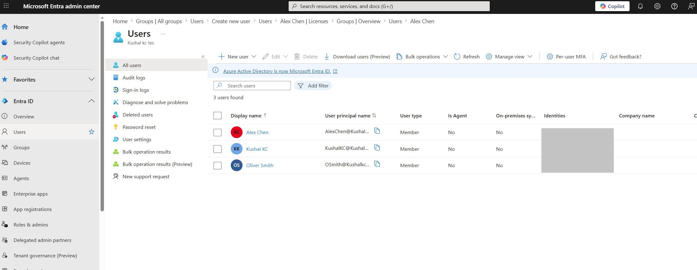

The tenant now shows **3 users found**:

| Display name | User type |
|---|---|
| Alex Chen | Member — newly created |
| Kushal KC | Member — tenant admin |
| Oliver Smith | Member — existing user |

---

## Part 2 — Assign a Microsoft 365 Licence

---

### Step 7 — Assign a licence via Microsoft 365 Admin Center

Switch to **admin.microsoft.com** and assign the licence to Alex Chen.

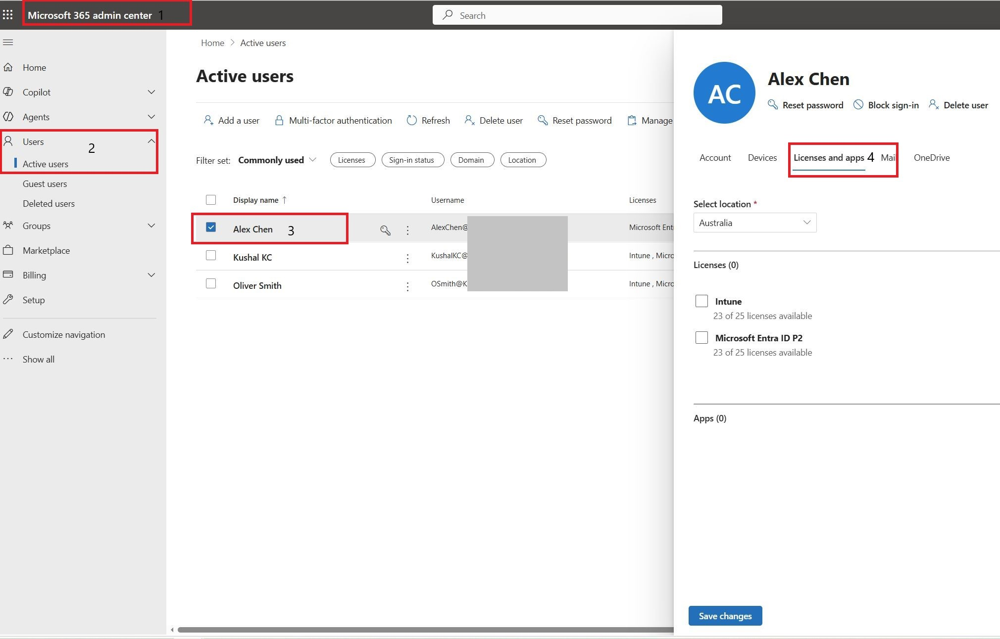

- Open **Microsoft 365 Admin Center (1)** at admin.microsoft.com
- Click **Users > Active users (2)** in the left nav
- Check the checkbox next to **Alex Chen (3)** — right-hand panel opens
- Click the **Licenses and apps (4)** tab in the panel

| Field | Value |
|---|---|
| Select location | `Australia` — set this FIRST, required before licence assignment |
| Intune | 23 of 25 licences available — tick to assign |
| Microsoft Entra ID P2 | 23 of 25 licences available — tick to assign |

Tick the required licences and click **Save changes**.

> A usage location is mandatory before any M365 licence can be assigned. Without it the assignment will fail. For Australian tenants always set **Australia** for data residency compliance.

---

## Part 3 — Create a New Security Group in Microsoft Entra ID

---

### Step 8 — Navigate to Groups and click New group

Go to **Entra ID > Groups**, then click **New group** in the toolbar.

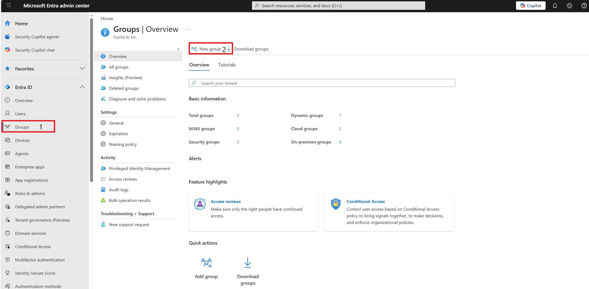

Groups Overview stats visible in this screenshot:

| Metric | Count |
|---|---|
| Total groups | 2 |
| Dynamic groups | 1 (KT-Grp-Allstaff) |
| M365 groups | 0 |
| Security groups | 2 |
| Cloud groups | 2 |
| On-premises groups | 0 |

---

### Step 9 — Configure the new group

Fill in all fields on the **New Group** form.

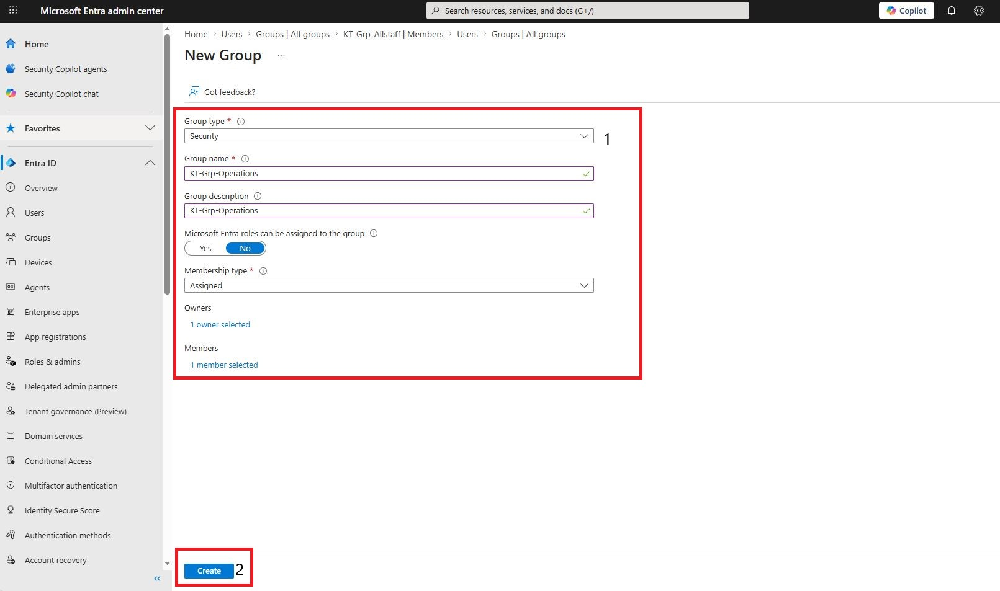

| Field | Value |
|---|---|
| Group type | `Security` |
| Group name | `KT-Grp-Operations` |
| Group description | `KT-Grp-Operations` |
| Entra roles assignable | `No` |
| Membership type | `Assigned` |
| Owners | 1 owner selected — Kushal KC |
| Members | 1 member selected |

- **Membership type: Assigned** — members are added and removed manually by an admin. Different from KT-Grp-Allstaff which uses **Dynamic** membership driven by attribute rules.
- **Entra roles assignable: No** — correct for a standard departmental group. Set Yes only for privileged access groups that need to hold Entra directory roles. Requires Entra ID P2.
- **This setting cannot be changed after the group is created** — double-check before clicking Create.

Click **Create**.

---

### Step 10 — Verify both groups in All groups

Navigate to **Groups > All groups** to confirm both groups exist.

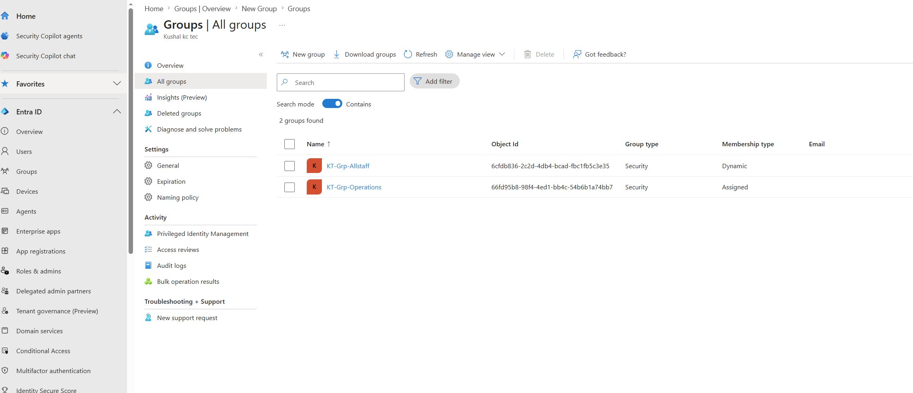

| Name | Group type | Membership type |
|---|---|---|
| KT-Grp-Allstaff | Security | Dynamic |
| KT-Grp-Operations | Security | Assigned |

The tenant now has 2 security groups — dynamic for all-staff policy targeting and assigned for operations team management.

---

## Part 4 — Configure MDM Automatic Enrollment Scope

---

### Step 11 — Open Devices and select the Windows platform

Go to **Devices > Overview**, then click the **Windows** platform tile.

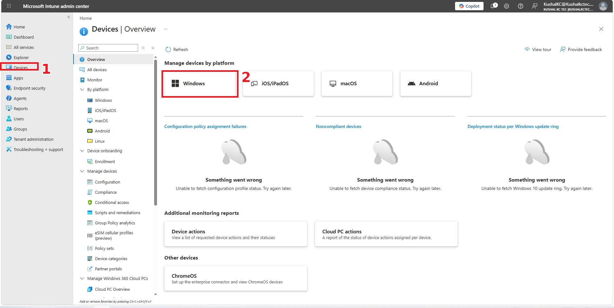

- **Devices (1)** selected in the left nav
- **Windows (2)** platform tile clicked to manage Windows-specific enrollment settings

The "Something went wrong" tiles on this overview are expected in a fresh trial tenant with no devices or policies enrolled yet — they will populate once devices and configuration profiles exist.

---

### Step 12 — Open Device onboarding and Enrollment

From the Windows devices view, expand **Device onboarding** and click **Enrollment**.

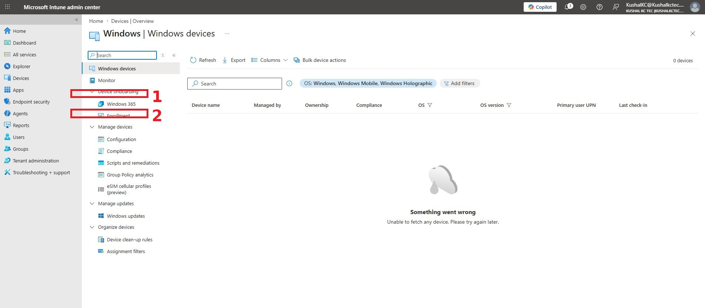

- **Device onboarding (1)** expanded in the left nav
- **Enrollment (2)** selected — this is where MDM scope and enrollment restrictions are configured

At this point **0 devices** are shown — nothing has enrolled into this tenant yet.

---

### Step 13 — Open Automatic Enrollment

On the Windows | Enrollment page, click **Automatic Enrollment**.

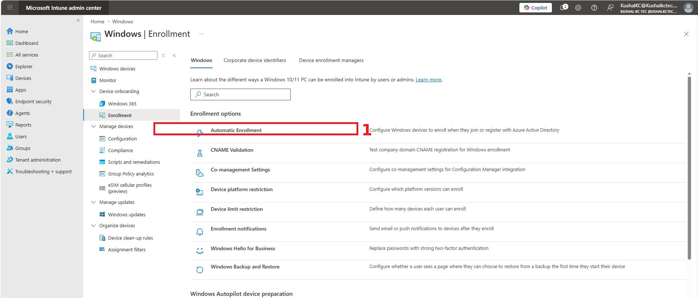

- **Automatic Enrollment (1)** — configures Windows devices to enroll automatically when they join or register with Microsoft Entra ID

This is the setting that controls whether a device gets MDM-managed the moment a work account signs in, versus requiring a separate manual enrollment step.

---

### Step 14 — Set MDM user scope to Some and select the group

Set **MDM user scope** to **Some**, then choose the group that should be in scope for automatic enrollment.

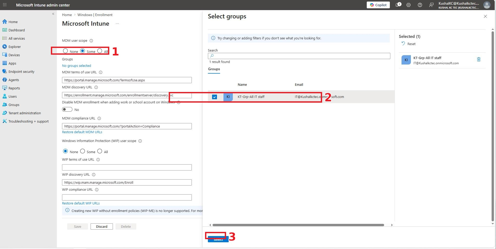

- **Some (1)** selected for MDM user scope — only members of a chosen group will be enrolled, rather than every user in the tenant
- **KT-Grp-All IT staff (2)** ticked in the Select groups panel — 1 result found, 1 selected
- **Select (3)** clicked to confirm the group choice

**Key point:** Scoping to **Some** with a specific group is the safer rollout pattern for production. Setting this to **All** would enroll every licensed user's device automatically — fine for a small pilot, but risky to apply tenant-wide without testing first.

---

### Step 15 — Confirm the group assignment

Back on the main enrollment configuration page, confirm the group count shown.

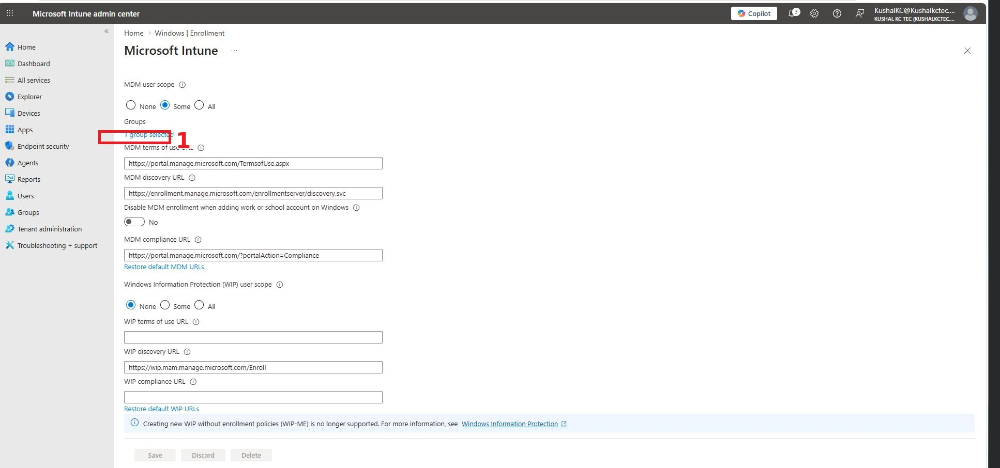

- **1 group selected (1)** confirms KT-Grp-All IT staff is now scoped for MDM automatic enrollment

Click **Save** to commit this configuration (not shown — Save/Discard/Delete buttons sit at the bottom of this page).

---

## Part 5 — Enroll the Windows Device

---

### Step 16 — Open Access work or school on the device

On the test VM (KT-LT-0001), open **Settings > Accounts**, then click **Access work or school**.

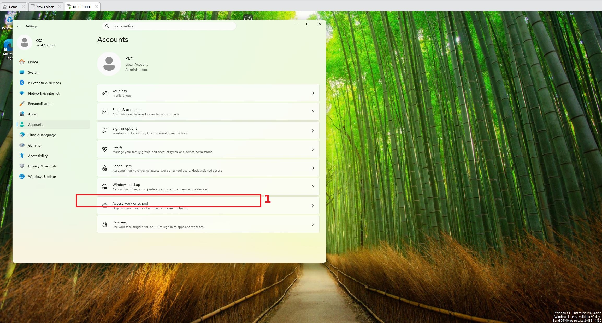

- **Access work or school (1)** — this is the entry point for joining a device to Entra ID or enrolling it in MDM

The device is currently signed in locally as **KKC (Local Account, Administrator)** — this is the lab admin account used to build the VM, separate from the end-user account being enrolled.

---

### Step 17 — Connect a work or school account

Click **Connect**, then enter the test user's email address.

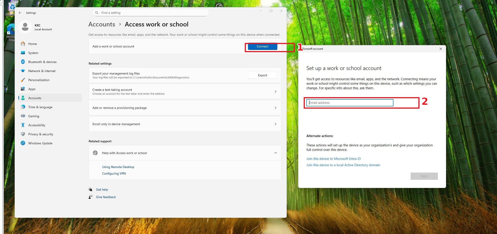

- **Connect (1)** clicked to open the Microsoft account dialog
- **Email address (2)** field — entered as the test user's UPN (osmith@kushalkctec.onmicrosoft.com)

Note the **Alternate actions** at the bottom of the dialog: **Join this device to Microsoft Entra ID** and **Join this device to a local Active Directory domain**. Using the email field directly (rather than these alternate links) adds a work account to the existing local profile rather than fully Entra-joining the device — the distinction matters for how the device shows up in Intune afterward.

---

### Step 18 — Enter password and sign in

Enter the password for the work account and click **Sign in**.

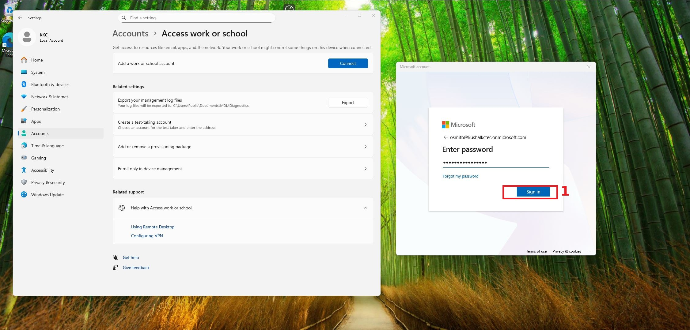

- **Sign in (1)** clicked after entering the password for osmith@kushalkctec.onmicrosoft.com

---

### Step 19 — Confirm the device is connected

The "You're all set!" screen confirms the device is now connected to the tenant.

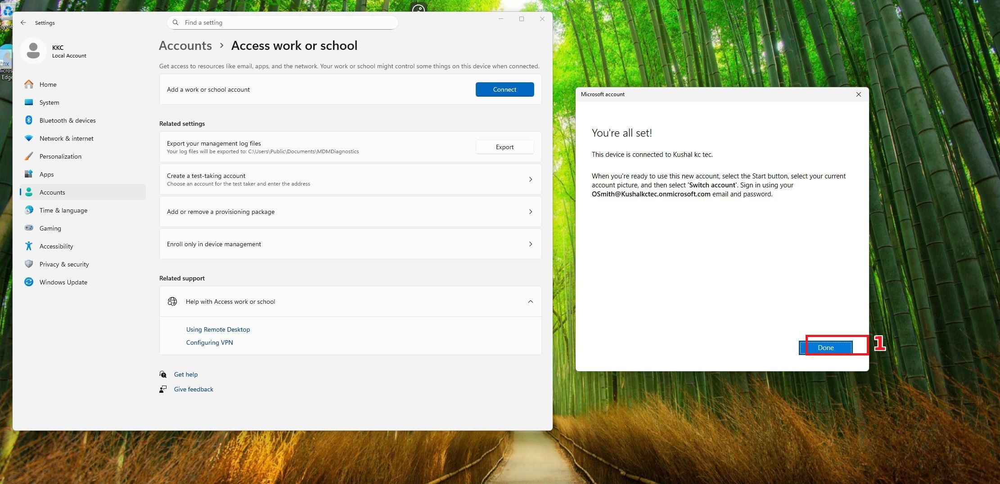

- **Done (1)** clicked to finish

The message confirms: **This device is connected to Kushal kc tec**, and explains that switching to this account requires using the Start button and Switch account, signing in with the OSmith@Kushalkctec.onmicrosoft.com email and password.

---

### Step 20 — Updates apply during enrollment

After confirming, the device applies policy and may show an update screen.

This full-screen message — **Updates are underway, please keep your computer on** — appears as Intune pushes initial policy and compliance settings to the newly enrolled device. No interaction is needed here, just patience.

---

### Step 21 — Windows Hello requirement enforced

On first sign-in with the new account, the device may prompt to set up Windows Hello.

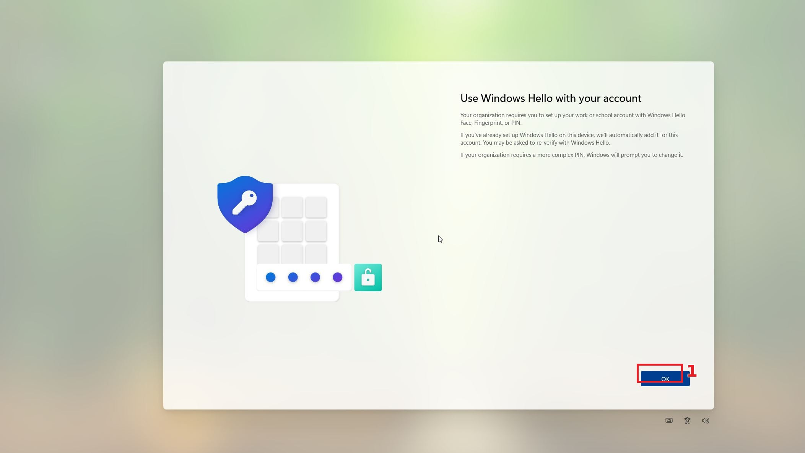

- **OK (1)** clicked to proceed

This prompt — **Your organization requires you to set up your work or school account with Windows Hello Face, Fingerprint, or PIN** — is strong evidence that a Conditional Access or Identity Protection policy is being enforced against this account, requiring stronger authentication before access is granted.

---

### Step 22 — Sign in as the enrolled user

After setup, switching accounts and signing in shows the new user on the Start menu.

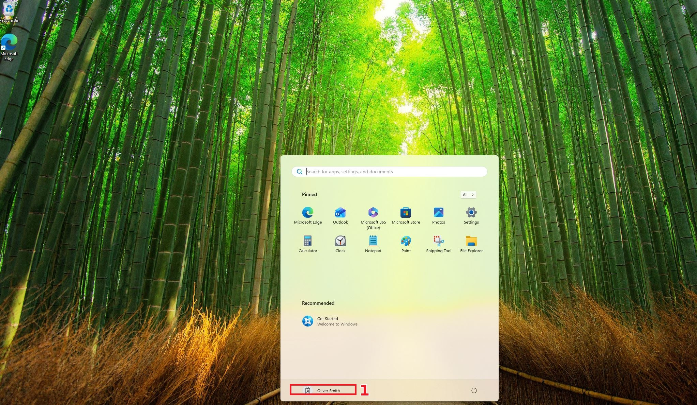

- **Oliver Smith (1)** shown at the bottom of the Start menu — confirms the device is now signed in as the enrolled work account rather than the local KKC admin account

---

### Step 23 — Verify the account in Manage Accounts

Open **Control Panel > User Accounts > Manage Accounts** to confirm the account type.

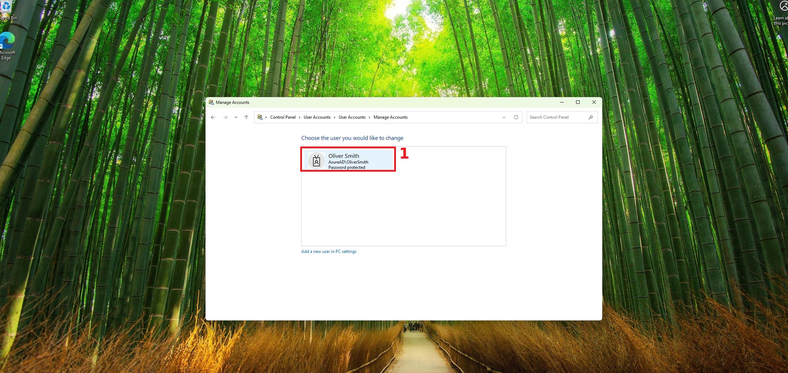

- **Oliver Smith — AzureAD\OliverSmith — Password protected (1)** confirms the account is registered on the device as an Entra ID (AzureAD) identity, not a local Windows account

This is the clearest proof point that the device-to-tenant connection succeeded: the account prefix **AzureAD\\** rather than a local machine name confirms cloud identity is now controlling sign-in on this device.

---

### Step 24 — Confirm the device appears in Intune as a managed device

Open the **Intune Admin Center > Devices > All devices** and confirm the enrolled device is now listed.

- **KT-LT-0001 (1)** appears in the All devices list — confirms Intune itself, not just the device's local enrollment wizard, recognises this device as managed
- Compliance status, OS version, and last check-in time confirm the device successfully completed MDM enrollment from the admin's point of view

This is the closing proof point for Phase 1: the device-side "You're all set" message (Step 19) only confirms the device attempted the join — this screenshot confirms Intune actually received and is tracking that enrollment.

## Key Concepts

### Dynamic vs Assigned Membership

| | Assigned | Dynamic |
|---|---|---|
| Membership | Admin manages manually | Entra ID manages via attribute rules |
| Licence required | Entra ID Free | Entra ID P1 or P2 |
| Use case | Small teams, project groups | All-staff, department-based targeting |

### UPN vs Mail Nickname

- **UPN** is the sign-in identity (`AlexChen@domain.com`) used for Entra ID authentication
- **Mail nickname** is the local part of the email address
- Mail nickname auto-derives from UPN prefix by default — only uncheck for a custom alias
- UPN must be unique across the entire tenant

### Usage Location

- Required before any M365 licence can be assigned
- Determines data residency and service availability by country
- For Australian tenants always set **Australia**

### Entra Roles Assignable to Group

- When Yes, the group can hold Entra ID directory roles (e.g. Global Admin, User Admin)
- Requires Entra ID P2 — only enable for privileged access groups
- **Cannot be changed after group creation**

### MDM User Scope: None vs Some vs All

| | None | Some | All |
|---|---|---|---|
| Behaviour | No automatic enrollment | Only selected groups auto-enroll | Every licensed user auto-enrolls |
| Use case | Manual enrollment only, or testing | Pilot groups, phased rollout | Mature tenant, organization-wide MDM |
| Risk | Lowest — nothing enrolls unexpectedly | Controlled — limited blast radius | Highest — any licensed user's device enrolls |

Scoping to **Some** with a defined group (as done here with KT-Grp-All IT staff) is the standard approach for testing and staged rollouts before expanding to **All**.

### Access Work or School vs Entra Join

Typing an email address directly into the **Add a work or school account** field adds a secondary work identity to the device alongside the existing local account. This is different from selecting **Join this device to Microsoft Entra ID**, which fully joins the device itself to the tenant and replaces the local sign-in model. Both paths can trigger MDM enrollment, but they register differently in Entra ID (Registered vs Entra joined) and affect what device-level policies can apply.

### Why Windows Hello Appeared

The Windows Hello prompt on first sign-in is a strong signal that a Conditional Access policy or Authentication Methods policy in the tenant requires phishing-resistant or multi-factor authentication for this account. This is expected behaviour once Conditional Access is layered on top of basic enrollment — it will be covered in more depth in a future phase.

### Confirming Enrollment Success

The most reliable on-device check that an Entra identity is active is the **AzureAD\\username** prefix shown in Control Panel's Manage Accounts. A local account would show the device's hostname instead (e.g. **KT-LT-0001\\KKC**). This distinction is a fast way to confirm whether a device-side issue is an enrollment problem or a sign-in problem.

---

## Common Issues and Troubleshooting

| Issue | Likely Cause | Resolution |
|---|---|---|
| Device does not appear in Intune after sign-in | Enrollment delay (sync can take several minutes) or MDM scope not saved | Wait for the next Intune sync cycle; confirm Automatic Enrollment was saved with the correct group |
| User not enrolling automatically despite Some scope | User's account is not actually a member of the scoped group | Verify group membership in Entra ID — direct or dynamic membership must be confirmed, not just intended |
| Windows Hello setup loops or fails | PIN complexity policy conflict, or TPM unavailable on the VM | Check Authentication Methods policy complexity requirements; confirm the VM has a virtual TPM enabled |
| Account shows as local instead of AzureAD in Manage Accounts | Email was added via "Add a work or school account" without completing full Entra join | Use Join this device to Microsoft Entra ID instead if a full device join is required |

---

## Lab Completion Summary

| Task | Status |
|---|---|
| Created user Alex Chen in Microsoft Entra ID | ✅ |
| Set UPN, display name, and auto-generated password | ✅ |
| Reviewed all wizard tabs before submission | ✅ |
| Verified Alex Chen in All users (3 users total) | ✅ |
| Set usage location to Australia | ✅ |
| Assigned M365 licences to Alex Chen | ✅ |
| Created KT-Grp-Operations — Assigned Security group | ✅ |
| Verified both groups in All groups list | ✅ |
| Set MDM user scope to Some, scoped to KT-Grp-All IT staff | ✅ |
| Confirmed 1 group selected on Automatic Enrollment | ✅ |
| Connected work account via Access work or school on KT-LT-0001 | ✅ |
| Signed in as osmith@kushalkctec.onmicrosoft.com | ✅ |
| Confirmed device connected — "You're all set" | ✅ |
| Windows Hello requirement enforced on first sign-in | ✅ |
| Verified AzureAD\\OliverSmith registered as the active account | ✅ |

---

*Kushaltec Lab · MD-102 Endpoint Administrator · Phase 1 Setup*  
*Tenant domain, UPNs, Object IDs, and passwords redacted or obscured where applicable.*
